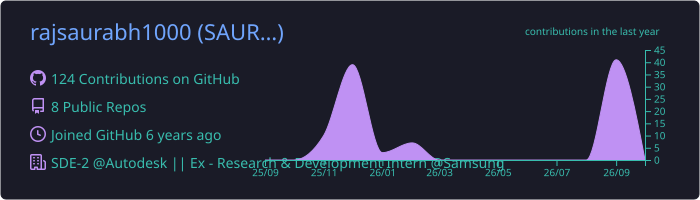
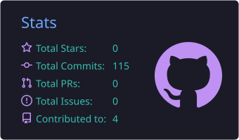
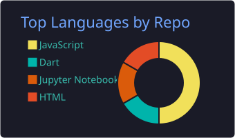
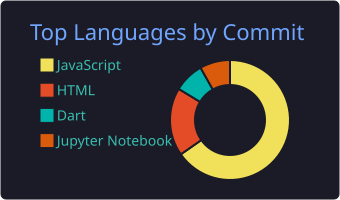

<h1 align="center">Hi, I'm Saurabh Raj 👋</h1>

  <b>Software Engineer (SDE-2) at Autodesk</b> · ex-R&amp;D intern at Samsung 
  I build full-stack systems end to end: backend services, real-time data pipelines and the dashboards on top of them.

  
  

---

### 🧭 What I work on

- **Backend & distributed systems:** APIs, event-driven pipelines, system design (LLD / HLD)
- **Real-time products:** WebSocket streaming, live dashboards, alerting
- **Security & observability:** threat scoring, MITRE ATT&CK enrichment, health monitoring
- **Shipping with AI:** using AI tools for velocity while owning the architecture, contracts and quality

### 🛠️ Tech stack

  
  
  
  
  
  
   
  
  
  
  
  
   
  
  
  
  
  
  

---

### 🚀 Featured projects

<table>
<tr>
<td width="50%" valign="top">

#### 🛡️ [Threat Command Center](https://github.com/rajsaurabh1000/frankenstein-threat-command-center)
Real-time SOC dashboard bridging a legacy **ASP.NET** API and a **PowerShell** attack simulator through a **Python/FastAPI** analytics engine: MITRE ATT&amp;CK enrichment, a live 3D attack globe, an instant critical alarm and one-click containment. 58 tests + Playwright in CI. 
**[▶ Live demo](https://frankenstein-threat-command-center.onrender.com)**

</td>
<td width="50%" valign="top">

#### 💰 [Retirement micro-savings API](https://github.com/rajsaurabh1000/blackrock-hackathon-submission-saurabhraj)
BlackRock hackathon: a REST API that rounds up expenses into micro-investments, validates wage and investment limits, and projects NPS vs index-fund returns. Node.js, Docker, tests.

</td>
</tr>
<tr>
<td width="50%" valign="top">

#### 🏆 [ProHireX](https://github.com/rajsaurabh1000/ProHireX-EY-GDS-Hackpions-3.0)
**First Runner-Up, EY GDS Hackpions 3.0 grand finale.** Automated CV screening that scores resumes against a job description. Python.

</td>
<td width="50%" valign="top">

#### 🧩 [Code Decoder](https://github.com/rajsaurabh1000/Code_Decoder)
A web app that explains the logic of any code snippet step by step, for developers stuck on unfamiliar code. JavaScript + Python.

</td>
</tr>
<tr>
<td width="50%" valign="top">

#### 📱 [LabelDuck](https://github.com/rajsaurabh1000/Google-BGN-Hackathon-2021)
Cross-platform Flutter app built for Google's BGN Hackathon 2021.

</td>
<td width="50%" valign="top">

#### 🩻 [COVID-19 X-ray detection](https://github.com/rajsaurabh1000/Covid-19-Chest-X-ray-detection)
A machine-learning model that classifies chest X-rays as COVID-19 positive or negative.

</td>
</tr>
</table>

### 🏅 Highlights

- 🥈 **First Runner-Up**, EY GDS Hackpions 3.0 (grand finale)
- 🧪 Hackathons: BlackRock, Google BGN 2021, EY GDS Hackpions
- 🏢 SDE-2 at **Autodesk** · R&amp;D intern at **Samsung**

---

### 📊 GitHub stats

  

  
  
  

  

---

### 📫 Get in touch

  
  

