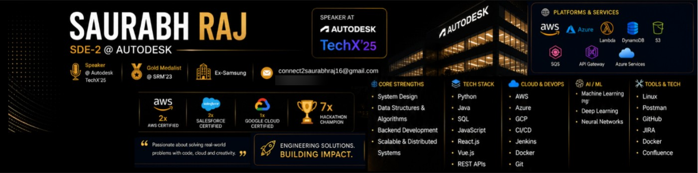
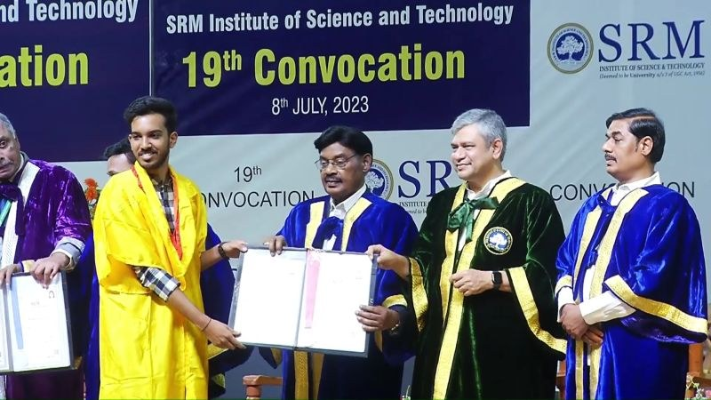
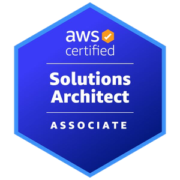
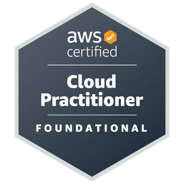

  

  <b>Software Development Engineer II at Autodesk</b> · 4+ years · Backend &amp; distributed systems · Bengaluru, India 
  I build secure, event-driven backend platforms on AWS, from identity and access governance to real-time data pipelines and the dashboards on top of them.

  
  
  

---

### 🧭 What I work on

- **Event-driven backends on AWS:** Lambda, API Gateway, EventBridge, SQS/SNS, DynamoDB and S3 workflows that replace manual operations
- **Identity & access governance:** access certification and review, provisioning and entitlement lifecycle, RBAC, SailPoint IdentityNow and Microsoft Graph
- **Production ownership:** deployment, monitoring, root-cause analysis, incident response and performance tuning of AWS distributed systems
- **AI & ML:** LLMs and prompt engineering in products; earlier, real-time computer vision on edge devices at Samsung

### 💼 Experience

| Role | Where | When |
|------|-------|------|
| **Software Development Engineer II** | Autodesk | Apr 2025 – present |
| **Software Development Engineer I** | Autodesk | Jul 2023 – Mar 2025 |
| **Software Engineer Intern** | Autodesk | Jul 2022 – Jun 2023 |
| **Associate Admin** | Google Cloud Community India | Dec 2021 – present |
| **Research &amp; Development Intern** · Certificate of Excellence | Samsung R&amp;D Institute India | Dec 2021 – Jul 2022 |
| **Data Engineer Trainee** | MedTourEasy | Feb 2021 |
| **Software Engineering Virtual Experience** | JPMorgan Chase &amp; Co. | May 2020 |

<b>Highlights</b>

- **Autodesk, SDE II:** led remediation of 5,000+ trust and compliance findings (90% reduction); designed event-driven workflows on Lambda, EventBridge, DynamoDB and S3 that automate daily aggregation of access-governance data; built cloud-native provisioning and entitlement services that cut fulfilment from days to minutes; own production services end to end.
- **Autodesk, SDE I:** owned quarterly access-review delivery across thousands of identities and entitlements; built a centralized RBAC-enabled attestation platform; re-architected high-volume compliance reporting on AWS serverless (no more timeouts); automated backup and recovery with DynamoDB, S3 and CloudFormation.
- **Autodesk, intern:** automated certification-campaign staging and activation, from several weeks to under 2 minutes.
- **Samsung R&amp;D:** "Video Frame Object Detection, Tracking and Tagging": a deep neural network (YOLOv5, ONNX, OpenCV, TensorFlow Lite, C++) to classify, localize and track objects in video frames; received a Certificate of Excellence.
- **MedTourEasy:** content-based recommendation system over the ingredient lists of 1,472 Sephora cosmetics, visualized with t-SNE and Bokeh.
- **JPMorgan virtual experience:** financial data feeds (Python), a React/TypeScript front end, and data visualization with Perspective.

### 🎤 Talks

- **Speaker, Autodesk TechX 2025**, Las Vegas, Nevada (May 2025)
- **EDC Tech Talk**, June 2023 session: presented a project idea

### 🏆 Hackathons &amp; competitions

| Result | Event |
|--------|-------|
| 🥈 **Grand Finale First Runner-Up** · ₹50,000 | **EY GDS Hackpions 3.0** (2021): CV screening with team ProHireX; 2,400 registrations → 200+ ideas → 13 finalists |
| 🥇 **Winner, Education Track** · $300 | **HackRU Fall 2021**, Rutgers University |
| 🌍 **1 of 65 selected worldwide** | **Google BGN Hackathon 2021**: built LabelDuck in a team of 7 |
| 🔟 **Top 10 of 93 teams** | **ESE S-Cube Hackathon** (2023), Autodesk, team ProHireX |
| 🏁 **Finalist** | **TechGig Code Gladiators 2023**: open round → semi-final → finale |
| 🏅 **Winner** | ESE's Week of Connection, Autodesk |

### 🎓 Education

<table>
<tr>
<td width="58%" valign="top">

**SRM Institute of Science &amp; Technology**, Chennai 
B.Tech in Electronics &amp; Computer Engineering · 2019 – 2023

- 🥇 **Gold Medalist · University Rank 1** (Certificate of Recognition for the highest CGPA)
- **CGPA 9.73 / 10**, with semester SGPAs of 9.5 · **10** · **10** · 9.55 · 9.87 · 9.52 · 9.55 · **10**
- SRMIST performance-based scholarship in 1st, 2nd and 3rd year

</td>
<td width="42%" valign="top">

SRM 19th Convocation, 8 July 2023

</td>
</tr>
</table>

### 📜 Certifications

  
  

| Certification | Issuer | Issued |
|---------------|--------|--------|
| **Identity Security Leader Credential** | SailPoint | Jan 2026 |
| **AWS Certified Solutions Architect – Associate** | Amazon Web Services | Dec 2025 |
| **AWS Certified Cloud Practitioner** | Amazon Web Services | Nov 2025 |
| **Professional Cloud Security Engineer** | Google Cloud | Oct 2024 |
| **Certified AI Specialist** | Salesforce | Oct 2024 |
| **Certified AI Associate** | Salesforce | Oct 2024 |

<b>Earlier certifications &amp; courses</b>

- Oracle Cloud Infrastructure 2024 Generative AI Certified Professional (2024) · OCI 2023 Certified Foundations Associate (2023)
- AWS Cloud Practitioner Essentials (2023)
- Neural Networks and Deep Learning, DeepLearning.AI (2021)
- Computer Science for Artificial Intelligence, Harvard University (edX Professional Certificate, 2021)
- Machine Learning, Stanford University (Coursera, 2020) · AI Foundations for Everyone, IBM (2020)
- C for Everyone, UC Santa Cruz (2020) · Programming for Everybody (Python), University of Michigan (2020)
- Introduction to the Internet of Things, CODE IOT (2020) · Learn with Google AI: Explore ML (2019)

### 🛠️ Tech stack

**Languages:**

**Cloud & DevOps:**

**Backend & frontend:**

**Identity & security:**

**AI & ML:**

---

### 🚀 Featured projects

<table>
<tr>
<td width="50%" valign="top">

#### 🛡️ [Threat Command Center](https://github.com/rajsaurabh1000/frankenstein-threat-command-center)
Real-time SOC dashboard bridging a legacy **ASP.NET** API and a **PowerShell** attack simulator through a **Python/FastAPI** analytics engine: MITRE ATT&amp;CK enrichment, a live 3D attack globe, an instant critical alarm and one-click containment. 58 tests + Playwright in CI.

</td>
<td width="50%" valign="top">

#### 🏆 [ProHireX](https://github.com/rajsaurabh1000/ProHireX-EY-GDS-Hackpions-3.0)
**First Runner-Up, EY GDS Hackpions 3.0 grand finale.** AI-powered recruitment platform using LLMs and NLP to rank resumes against job descriptions, with an explainable scoring engine (skills, experience, education, location). Python.

</td>
</tr>
<tr>
<td width="50%" valign="top">

#### 🦆 [LabelDuck](https://github.com/rajsaurabh1000/Google-BGN-Hackathon-2021)
**Google BGN Hackathon.** Crowdsourced data-annotation platform that helps startups build high-quality ML datasets: ML inference plus human validation, with an incentive-driven workflow. Flutter, Firebase.

</td>
<td width="50%" valign="top">

#### 💰 [Retirement micro-savings API](https://github.com/rajsaurabh1000/blackrock-hackathon-submission-saurabhraj)
**BlackRock hackathon.** REST API that rounds up expenses into micro-investments, validates wage and investment limits, and projects NPS vs index-fund returns. Node.js, Docker, tests.

</td>
</tr>
<tr>
<td width="50%" valign="top">

#### 🧩 [Code Decoder](https://github.com/rajsaurabh1000/Code_Decoder)
A web app that explains the logic of any code snippet step by step. JavaScript + Python.

</td>
<td width="50%" valign="top">

#### 🩻 [COVID-19 X-ray detection](https://github.com/rajsaurabh1000/Covid-19-Chest-X-ray-detection)
A machine-learning model that classifies chest X-rays as COVID-19 positive or negative.

</td>
</tr>
</table>

### 📊 GitHub stats

  

  
  
  

  

